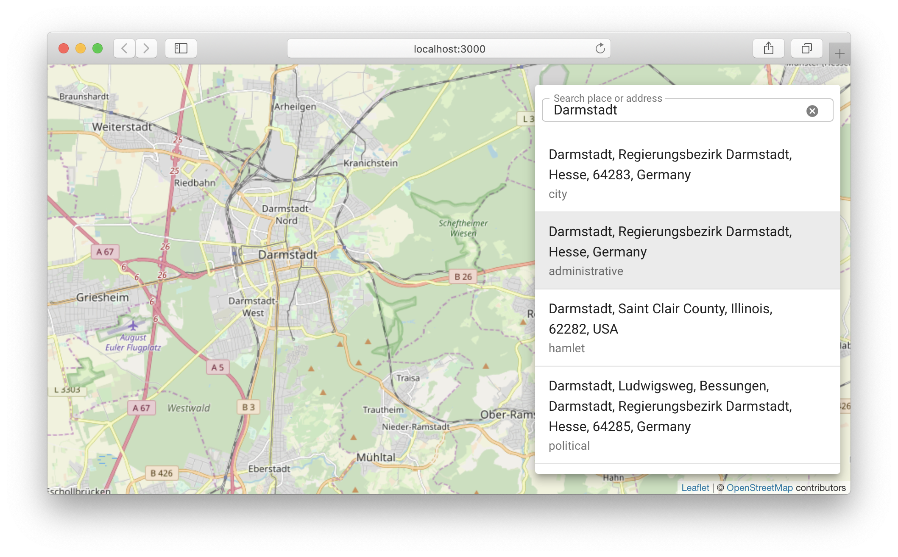

This project was bootstrapped with [Create React App](https://github.com/facebook/create-react-app).

### Why?

To get an idea of [React](https://reactjs.org) and [Material-UI](https://material-ui.com).

### What?

* Simple React wrapper for Leaflet
* [Nominatim search](https://nominatim.openstreetmap.org) (Material-UI TextField/ListItem)

## How?

The usual `create-react-app` scripts:
* `npm start` (should work)
* `npm test` (don't care for now)
* `npm run build` (don't care for now)
